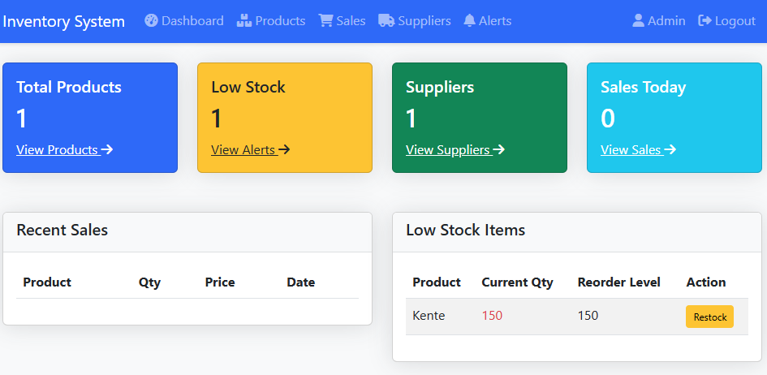

# Inventory Management System

A simple web-based inventory management system built with PHP and MySQL that helps track products, sales, and suppliers.



## Features

- Dashboard with key metrics and alerts
- Product management (add, edit, delete)
- Sales tracking and history
- Supplier management
- Low stock alerts
- Responsive Bootstrap UI

## Requirements

- PHP 7.4+
- MySQL 5.7+
- Web server (Apache/NGINX)
- MAMP or similar local development environment

## Installation

1. Clone this repository to your web server directory:
```bash
git clone https://github.com/yourusername/inventory-management-system.git
```

2. Create a MySQL database named `inventory_db`

3. Update database credentials in `includes/config.php`:
```php
$host = 'localhost:3307';
$dbname = 'inventory_db';
$username = 'invent';
$password = 'root';
```

4. The tables will be created automatically on first run

## Usage

Access the system through your web browser:
```
http://localhost/inventory-system/
```

### Main Features:
- **Dashboard**: View key metrics and recent activities
- **Products**: Manage product inventory
- **Sales**: Record and track sales
- **Suppliers**: Manage supplier information
- **Alerts**: Monitor low stock items

## Directory Structure

```
/inventory-system/
│── index.php                # Dashboard
│── products.php             # Product management
│── sales.php               # Sales tracking
│── suppliers.php           # Supplier management
│── alerts.php              # Stock alerts
│── includes/
│   │── config.php          # Database connection
│   │── header.php          # Common header
│   │── footer.php          # Common footer
│── assets/
│   │── css/
│   │   │── style.css       # Custom styles
│   │── js/
│   │   │── script.js       # Custom JavaScript
```

## License

This project is licensed under the MIT License - see the [LICENSE](LICENSE) file for details.

## Contributing

1. Fork the repository
2. Create a feature branch
3. Commit your changes
4. Push to the branch
5. Create a Pull Request

## Author

Reiss Niih Boafo

## Support


For support, please open an issue in the GitHub repository.

